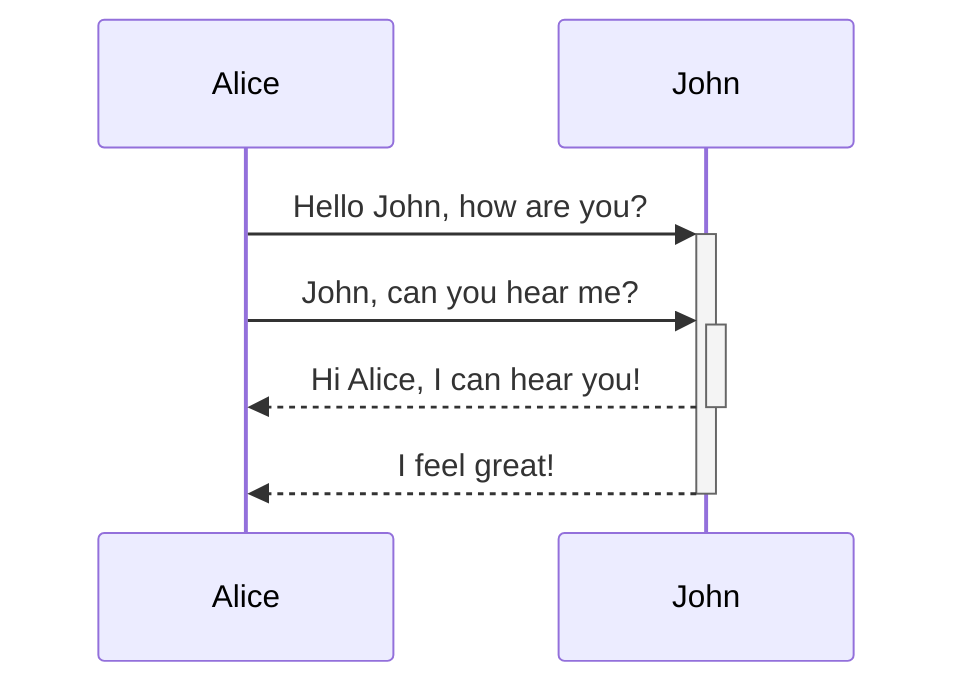
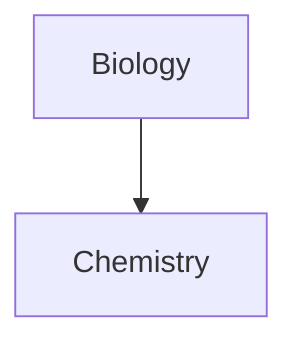

https://help.obsidian.md/

```bash


```


- [x] This is a completed task.
- [ ] This is an incomplete task.

--- 


> [!info] Information de derniere minute
> Here's a callout block.
> 

> [!tip] Callouts can have custom titles
> Like this one.

> [!danger] Callouts can have custom titles
> Like this one.

> [!question] Can callouts be nested?
> > [!todo] Yes!, they can.
> > > [!example]  You can even use multiple layers of nesting.


https://help.obsidian.md/callouts#Supported+types

<iframe src="https://help.obsidian.md/callouts#Supported+types" style="width:100%; height:500px;overflow:auto;"
```></iframe>






$$
\begin{vmatrix}a & b\\
c & d
\end{vmatrix}=ad-bc
$$

This is an inline math expression $e^{2i\pi} = 1$.


<iframe src="http://localhost:8025/" style="width:100%; height:500px;overflow:auto;"
```></iframe>

![[documents_pour_les_joueurs.base]]

