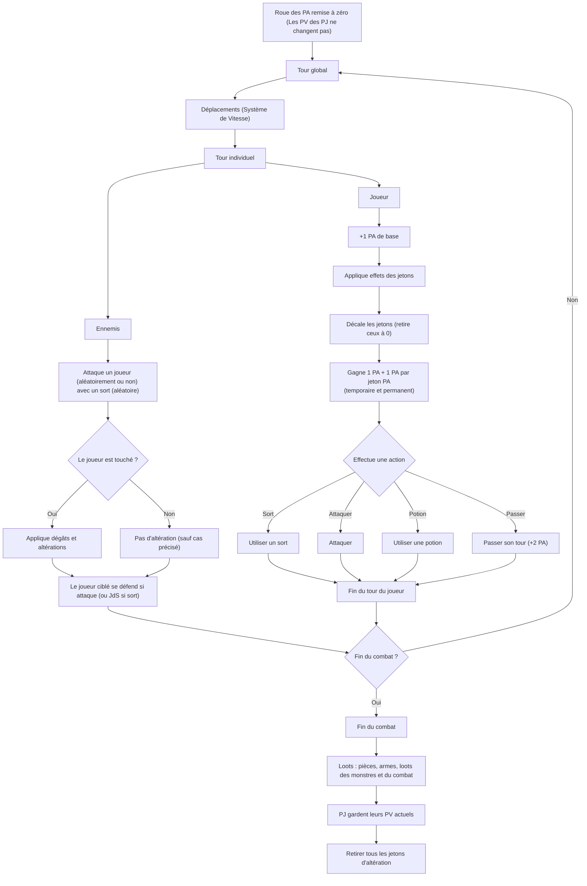

```mermaid
flowchart TD
  C["Roue des PA remise à zéro (Les PV des PJ ne changent pas)"]

  C --> D["Tour global"]
  D --> E["Déplacements (Système de Vitesse)"]

  E --> F["Tour individuel"]

  %% --- Tour Joueur ---
  F --> G["Joueur"]
  G --> G1["+1 PA de base"]
  G1 --> G2["Applique effets des jetons"]
  G2 --> G3["Décale les jetons (retire ceux à 0)"]
  G3 --> G4["Gagne 1 PA + 1 PA par jeton PA\n(temporaire et permanent)"]

  G4 --> G6{"Effectue une action"}
  G6 -->|Sort| G7["Utiliser un sort"]
  G6 -->|Attaquer| G8["Attaquer"]
  G6 -->|Potion| G9["Utiliser une potion"]
  G6 -->|Passer| G10["Passer son tour (+2 PA)"]
  G7 --> H["Fin du tour du joueur"]
  G8 --> H
  G9 --> H
  G10 --> H

  %% --- Tour Ennemi ---
  F --> I["Ennemis"]
  I --> I1["Attaque un joueur (aléatoirement ou non) avec un sort (aléatoire)"]
  I1 --> I3{"Le joueur est touché ?"}
  I3 -->|Oui| I4["Applique dégâts et altérations"]
  I3 -->|Non| I5["Pas d'altération (sauf cas précisé)"]
  I4 --> I6["Le joueur ciblé se défend si attaque (ou JdS si sort)"]
  I5 --> I6
  I6 --> K

  %% --- Fin de tour commune ---
  H --> K{"Fin du combat ?"}

  K -->|Non| D
  K -->|Oui| L["Fin du combat"]

  L --> L1["Loots : pièces, armes, loots des monstres et du combat"]
  L1 --> L2["PJ gardent leurs PV actuels"]
  L2 --> L3["Retirer tous les jetons d'altération"]
```
