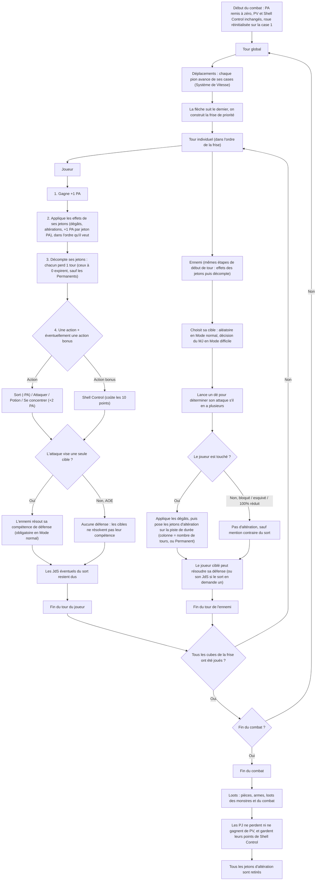

```mermaid
flowchart TD
  C["Début du combat : PA remis à zéro, PV et Shell Control inchangés, roue réinitialisée sur la case 1"]

  C --> D["Tour global"]
  D --> E["Déplacements : chaque pion avance de ses cases (Système de Vitesse)"]
  E --> E2["La flèche suit le dernier, on construit la frise de priorité"]

  E2 --> F["Tour individuel (dans l'ordre de la frise)"]

  %% --- Tour Joueur ---
  F --> G["Joueur"]
  G --> G1["1. Gagne +1 PA"]
  G1 --> G2["2. Applique les effets de ses jetons (dégâts, altérations, +1 PA par jeton PA), dans l'ordre qu'il veut"]
  G2 --> G3["3. Décompte ses jetons : chacun perd 1 tour (ceux à 0 expirent, sauf les Permanents)"]
  G3 --> G6{"4. Une action + éventuellement une action bonus"}

  G6 -->|Action| G7["Sort (-PA) / Attaquer / Potion / Se concentrer (+2 PA)"]
  G6 -->|Action bonus| G11["Shell Control (coûte les 10 points)"]

  G7 --> G12{"L'attaque vise une seule cible ?"}
  G11 --> G12
  G12 -->|Oui| G13["L'ennemi résout sa compétence de défense (obligatoire en Mode normal)"]
  G12 -->|Non, AOE| G14["Aucune défense : les cibles ne résolvent pas leur compétence"]
  G13 --> G15["Les JdS éventuels du sort restent dus"]
  G14 --> G15
  G15 --> H["Fin du tour du joueur"]

  %% --- Tour Ennemi ---
  F --> I["Ennemi (mêmes étapes de début de tour : effets des jetons puis décompte)"]
  I --> I1["Choisit sa cible : aléatoire en Mode normal, décision du MJ en Mode difficile"]
  I1 --> I2["Lance un dé pour déterminer son attaque s'il en a plusieurs"]
  I2 --> I3{"Le joueur est touché ?"}
  I3 -->|Oui| I4["Applique les dégâts, puis pose les jetons d'altération sur la piste de durée (colonne = nombre de tours, ou Permanent)"]
  I3 -->|Non, bloqué / esquivé / 100% réduit| I5["Pas d'altération, sauf mention contraire du sort"]
  I4 --> I6["Le joueur ciblé peut résoudre sa défense (ou son JdS si le sort en demande un)"]
  I5 --> I6
  I6 --> J["Fin du tour de l'ennemi"]

  %% --- Fin de tour commune ---
  H --> K{"Tous les cubes de la frise ont été joués ?"}
  J --> K
  K -->|Non| F
  K -->|Oui| L{"Fin du combat ?"}

  L -->|Non| D
  L -->|Oui| M["Fin du combat"]

  M --> M1["Loots : pièces, armes, loots des monstres et du combat"]
  M1 --> M2["Les PJ ne perdent ni ne gagnent de PV, et gardent leurs points de Shell Control"]
  M2 --> M3["Tous les jetons d'altération sont retirés"]
```
